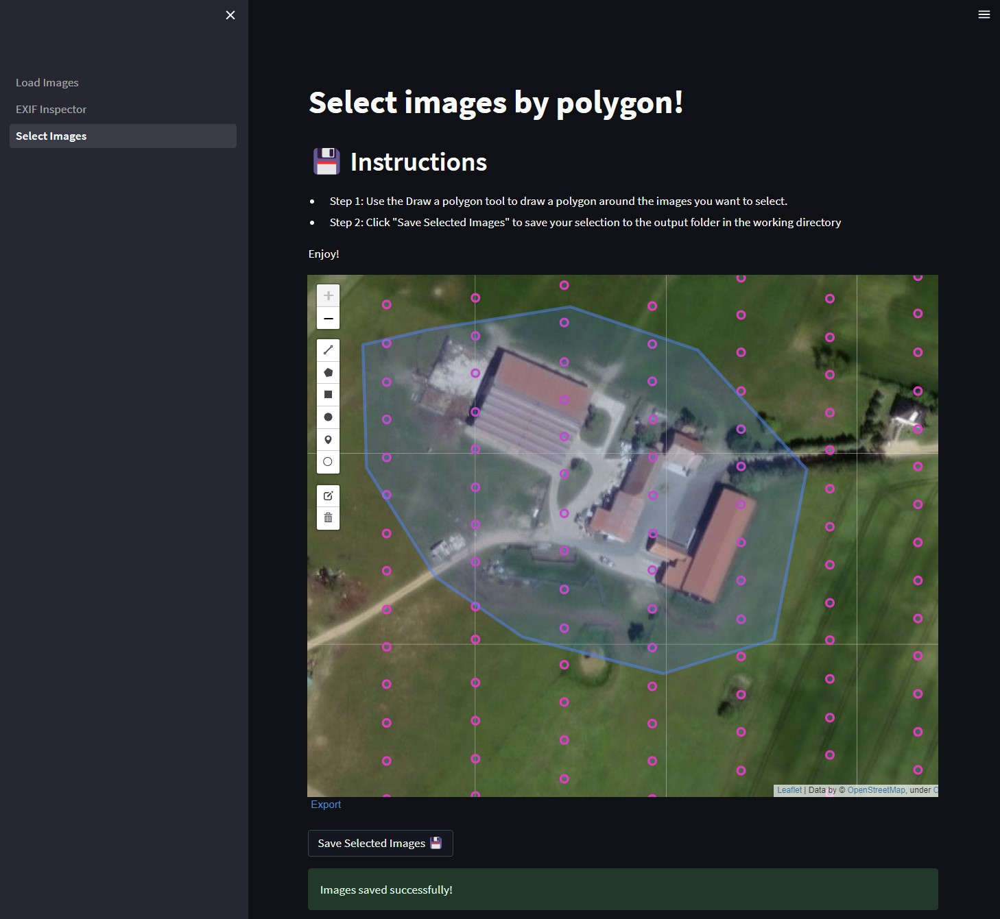

# UAV Image Toolbox
This project is a tool for reading drone images to inspect their EXIF and other metadata tags. It also allows you to select a subset
of your images by an interactive polygon selection and stores a copy of them in an output folder.
It uses Python, the Streamlit framework for UI and the ExifTool by Phil Harvey.

## Installation
Before running this project, you should make sure to:

1. Install ExifTool by Phil Harvey so its available in you PATH: [exiftool.org](https://exiftool.org/)
2. Install the following python packages:
   * datetime
   * folium
   * geopandas
   * glob
   * numpy
   * os
   * pandas
   * PIL
   * pyexiftool
   * shapely
   * shutil 
   * streamlit
   * streamlit_folium
 
  

To run the project, go to the UAV_Image_Toolbox directory and run the command: **streamlit run 1_Load_Images.py**

## Usage
* Place your images into the data folder of th eprojects working directory.
* Start the application by running the streamlit run 1_Load_Images.py command.
From there, you will be able to select either the demo directoryor your data directoy.
* Once a directory has been selected the image meta data will be loaded and you can select the **Exif_Inspector** or **Select_Images** subpags on the left sidebar

## Limitations

Only  tested with DJI M3M, DJI P4M and XAG M500 images so far, other cameras might have different tags which might break things.

## Contributing
Contributions are welcome!

## Credits
* Streamlit - a user-friendly framework for building data analysis and visualization applications
* ExifTool by Phil Harvey
Read, Write and Edit Meta Information!

## License
The contents of this repository are covered under the MIT License.

## Contact
If you have any questions or feedback, please reach out via github 21satspleb
